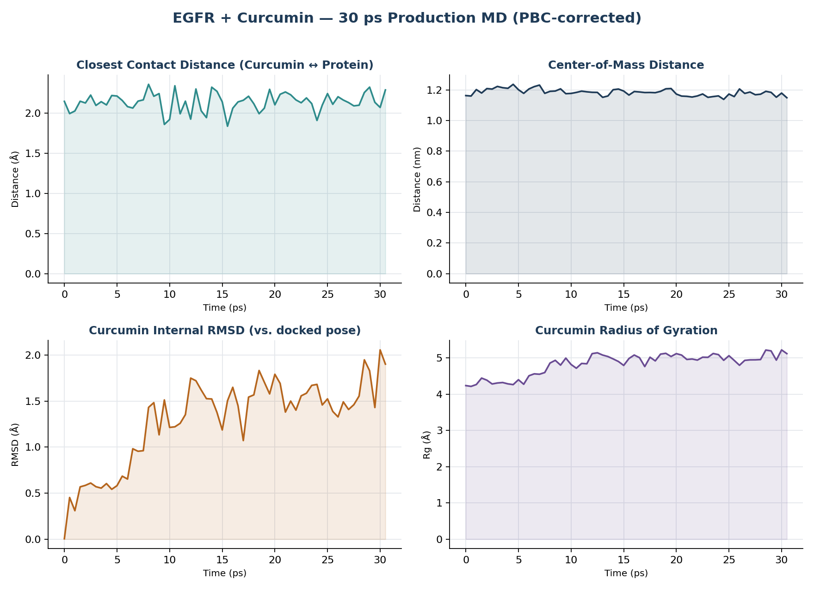

# EGFR Docking + MD — Curcumin, Doxorubicin, Erlotinib, Gefitinib vs. EGFR Kinase Domain

Structure-based screening of four small molecules against the **EGFR (Epidermal
Growth Factor Receptor) tyrosine kinase domain** — a validated cancer drug target —
using **AutoDock Vina** docking, cross-checked with a short **GROMACS** molecular
dynamics run on the top literature-relevant hit (curcumin).

This is the capstone project of a four-part computational-chemistry portfolio; see
also the [DFT binding study](https://github.com/sareer555/curcumin-doxorubicin-GO-DFT)
and [MD stability study](https://github.com/sareer555/curcumin-GO-MD-GROMACS) on
curcumin/doxorubicin adsorption to graphene oxide.

**Live dashboard:** https://sareer555.github.io/egfr-docking-md/

## Headline results

| Ligand | Vina top score (kcal/mol) | Notes |
|---|---|---|
| Doxorubicin | **-10.49** | Reference chemotherapeutic |
| Gefitinib | **-9.08** | Approved EGFR inhibitor (reference) |
| Erlotinib | **-7.93** | Approved EGFR inhibitor; re-docked to validate protocol: **1.93 Å RMSD** to its known crystal pose |
| Curcumin | **-7.82** | Natural-product candidate |

More negative = stronger predicted binding. Erlotinib's re-docking RMSD (1.93 Å,
well under the standard <2 Å "correct pose" threshold) confirms the docking
protocol — receptor prep, search-box placement, scoring — reproduces a known
experimental binding pose before trusting it on the other three ligands.

**30 ps production MD (curcumin, PBC-corrected trajectory):**

| Metric | Range | Mean ± SD |
|---|---|---|
| Closest contact distance | 1.84–2.36 Å | 2.14 ± 0.12 Å |
| Center-of-mass distance | 1.137–1.236 nm | 1.183 ± 0.022 nm |
| Curcumin internal RMSD (vs. docked pose) | 0.00–2.06 Å | 1.29 ± 0.46 Å |
| Curcumin radius of gyration | 4.22–5.22 Å | 4.83 ± 0.30 Å |

Curcumin stays in tight, stable contact with the EGFR ATP pocket over the full
window, while undergoing normal conformational relaxation expected of a
flexible, multi-rotatable-bond molecule settling from a rigid docked pose.



## Honest scope and limitations

- **30 ps is short.** This is roughly 1/16th the length of this portfolio's own
  prior MD study (500 ps, on graphene oxide) and far short of literature-scale
  protein-ligand production runs (10s–100s of ns). Treat the MD result as a
  proof-of-concept "does the docked pose immediately fall apart" check, not a
  thermodynamic stability claim.
- **Compute budget:** this ~114,573-atom solvated system runs at only ~2.15–2.2
  ns/day in the sandbox used, versus ~12–18 ns/day for the much smaller
  (~14,000-atom) graphene-oxide system in the earlier MD project — the
  production run length was capped by this, not by a scientific choice.
- **Missing loop:** residues 965–976 are disordered in the 1M17 crystal
  structure (a real gap in the experimental data, not introduced by processing)
  and are absent from the simulated protein; a `TER` record marks this as a
  genuine chain break rather than letting `pdb2gmx` bond incorrectly across it.
- **MD was only run for curcumin**, the ligand most relevant to this portfolio's
  earlier DFT/MD work — doxorubicin, erlotinib, and gefitinib were docked and
  scored, but not carried through to MD.
- **Full-system trajectory not included** in this repo (water-included .xtc
  files are 25+ MB); `data/production_solute_only.xtc` includes only the
  protein+curcumin atoms (no water), sufficient to reproduce every figure here.

## Methodology

### 1. Docking (AutoDock Vina 1.2.5 + Open Babel 3.1.1)

- **Receptor:** PDB [1M17](https://www.rcsb.org/structure/1M17) — EGFR kinase
  domain (residues 671–998), co-crystallized with erlotinib (HET code AQ4).
  Chosen for its wide use in the docking literature and its experimentally
  confirmed ATP-pocket ligand pose (used below for validation).
- **Receptor prep:** protein-only atoms extracted, hydrogens added at pH 7.4
  (`obabel -p 7.4`), converted to a rigid-receptor PDBQT (`obabel -xr`).
- **Ligand prep:** 3D structures generated from SMILES (`obabel --gen3d -p 7.4`)
  for curcumin, doxorubicin, erlotinib, gefitinib.
- **Search box:** centered on the crystallographic AQ4 (erlotinib) coordinates,
  extracted from 1M17's HETATM records — i.e., docking targets the real,
  experimentally known ATP-binding pocket rather than a blind whole-protein search.
- **Validation:** erlotinib was re-docked into 1M17 and its top pose compared to
  the crystal structure's actual erlotinib coordinates via `obrms -m`
  (graph-based atom correspondence, needed since PDBQT/PDB atom
  order/naming differ) — **1.93 Å RMSD**, confirming the protocol reproduces
  a known experimental result before trusting it on the other three ligands.

Full commands: [`scripts/docking_commands.sh`](scripts/docking_commands.sh).

### 2. MD system build (GROMACS, AMBER99SB-ILDN + TIP3P)

A step up from this portfolio's earlier graphene-oxide MD project, which used a
"parameterize by chemical analogy" fallback for its force field — here the
**protein uses a real, validated force field** (AMBER99SB-ILDN), since GROMACS
ships it natively; curcumin keeps its own custom-parameterized topology
(`topology/curcumin.itp`) from the earlier DFT/MD work.

Five issues were found and fixed during setup, each independently validated
rather than just "ran without an error":

1. **Missing-loop "Long Bond" warning** — residues 965–976 are genuinely absent
   from the 1M17 crystal (confirmed by a residue-numbering gap check); fixed by
   inserting a `TER` record so `pdb2gmx` treats it as a real chain break.
2. **Atom-order/count mismatch** between curcumin's docked pose (29 united-atom
   PDBQT atoms) and its pre-existing all-atom topology (47 atoms) — fixed via
   `obabel -h` (restore merged hydrogens) + an RDKit substructure match
   (`GetSubstructMatch`) to reorder atoms to the topology's expected order.
   Validated independently: 0/47 element-identity mismatches, all 48 bonds
   within a chemically normal 0.969–1.506 Å range.
3. **Silent global atomtype collision** — curcumin's custom "H" type (from the
   earlier project's simplified force field) collided with AMBER99SB-ILDN's own
   "H" type, which could have silently corrupted every polar hydrogen's van der
   Waals behavior across all 312 protein residues, not just curcumin. Fixed by
   renaming curcumin's type to "H_curc"; confirmed via `grompp` warning count
   dropping from 1 to 0.
4. **Position restraints used global atom indices** instead of the local
   indices required inside a standalone `moleculetype` block — fixed by
   renumbering.
5. **Box shape:** rhombic dodecahedron instead of cubic (~29% smaller volume for
   the same 1.2 nm solvent padding — standard efficiency choice for a roughly
   globular solute).

System: 114,573 atoms total (5,079 protein+curcumin, 36,498 TIP3P waters, 8 Na⁺
ions for charge neutralization).

Full commands: [`scripts/md_pipeline_commands.sh`](scripts/md_pipeline_commands.sh).

### 3. Equilibration and production

Energy minimization (steepest descent, converged in 1355 steps, Fmax 983.9) →
NVT (10 ps, position-restrained, 297.8 K) → NPT (10 ps, `refcoord_scaling = com`
required alongside position restraints under pressure coupling, 300.1 K,
-36.8 bar) → production (30 ps, restraints off).

**PBC correction:** the raw production trajectory gave a physically impossible
11.2–11.3 nm center-of-mass distance (the system's own box is only ~9.4 nm
across) — a classic periodic-boundary "wrap-around" artifact from not
re-centering the trajectory first. `gmx trjconv -pbc mol -center` was applied
before any spatial-distance analysis; all reported numbers use the corrected
trajectory.

### 4. Analysis

`gmx mindist` (closest contact), `gmx traj -com` (center-of-mass positions, used
to compute inter-group COM distance), `gmx rms` / `gmx gyrate` (curcumin's own
internal shape stability) — same toolset as this portfolio's earlier MD project.
Plotted with `scripts/plot_production_analysis.py` (matplotlib).

## Repository structure

```
structures/   1M17.pdb, receptor.pdbqt, ligand PDBQT files (prepared + docked), SMILES
topology/     curcumin.itp, curcumin_atomtypes.itp, posre_curcumin.itp, topol.top
mdp/          ions.mdp, minim.mdp, nvt.mdp, npt.mdp, production.mdp
scripts/      docking_commands.sh, md_pipeline_commands.sh, build_complex_gro.py,
              reorder_curcumin.py, verify_mapping.py, plot_production_analysis.py
data/         mindist.xvg, protein_com.xvg, curcumin_com.xvg, curcumin_rmsd.xvg,
              curcumin_rg.xvg, production_solute_only.xtc (protein+curcumin only)
figures/      production_analysis.png
docs/         GitHub Pages dashboard
```

## Reproducing this

```bash
# Docking
bash scripts/docking_commands.sh

# MD (requires GROMACS with AMBER99SB-ILDN and TIP3P, both bundled with a
# standard GROMACS install)
bash scripts/md_pipeline_commands.sh
```

## Tools

AutoDock Vina 1.2.5 · Open Babel 3.1.1 · GROMACS (AMBER99SB-ILDN, TIP3P) ·
RDKit · Python (matplotlib, numpy)
